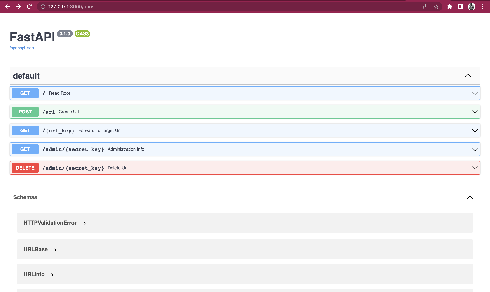

# UrlShortener


This is mini-app built using FastApi and powered by uvicorn server to shorten long Urls and be able to share it people

## Getting Started

These instructions will get you a copy of the project up and running on your local machine for development and testing purposes.

### Prerequisites

What things you need to install the software and how to install them.

- Python 3.10 or higher
- Pip
- Virtualenv
- Fastapi
- Uvicorn
- sqlalchemy
- validators
- python-dotenv

### Installing

- Clone the repository

```bash
git clone https://github.com/Marsh-sudo/ShortenerUrls.git && cd ShortenerUrls
```

- Create a virtual environment

```bash
virtualenv venv
```

- Activate the virtual environment

```bash
source venv/bin/activate
```

- Install the dependencies

```bash
pip install -r requirements.txt
```
- Run the app

```bash
(venv) $ uvicorn shortener_app.main:app --reload
```